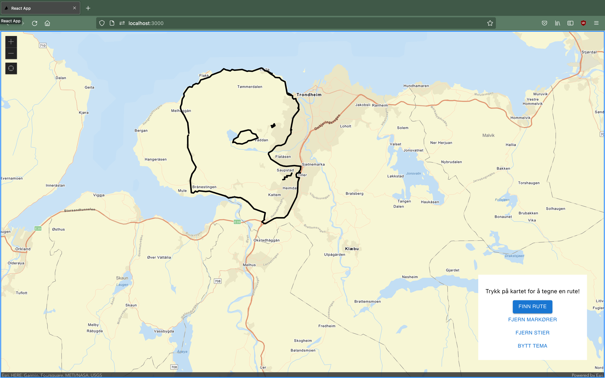

# Veitegninger

## Velg punkter og lag en veitegning

Alt du må gjøre er å velge et knippe punkter og trykke på "Finn rute".

Ved å trykke på "Fjern markører" kan du slette punktene du har valgt og velge ny, for deretter å tegne en ny rute.Alt

## Det betyr at du kan lage kompliserte tegninger med flere usammenhengende deler!

Se for eksempel dette fantastiske eksempelet:

