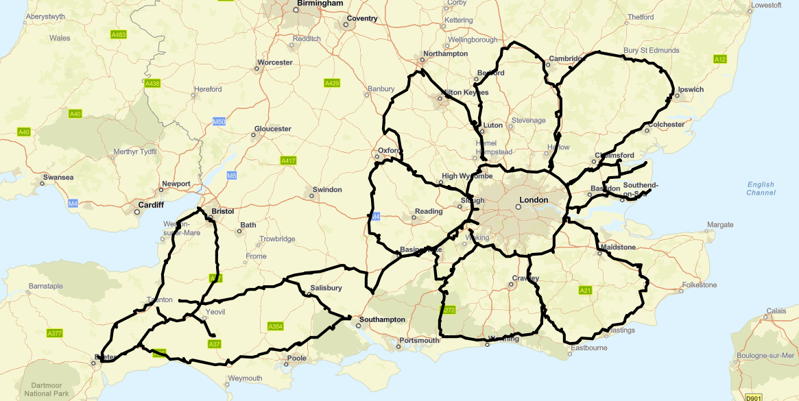
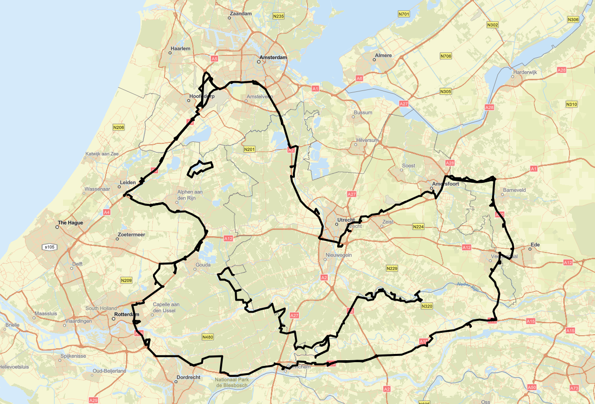
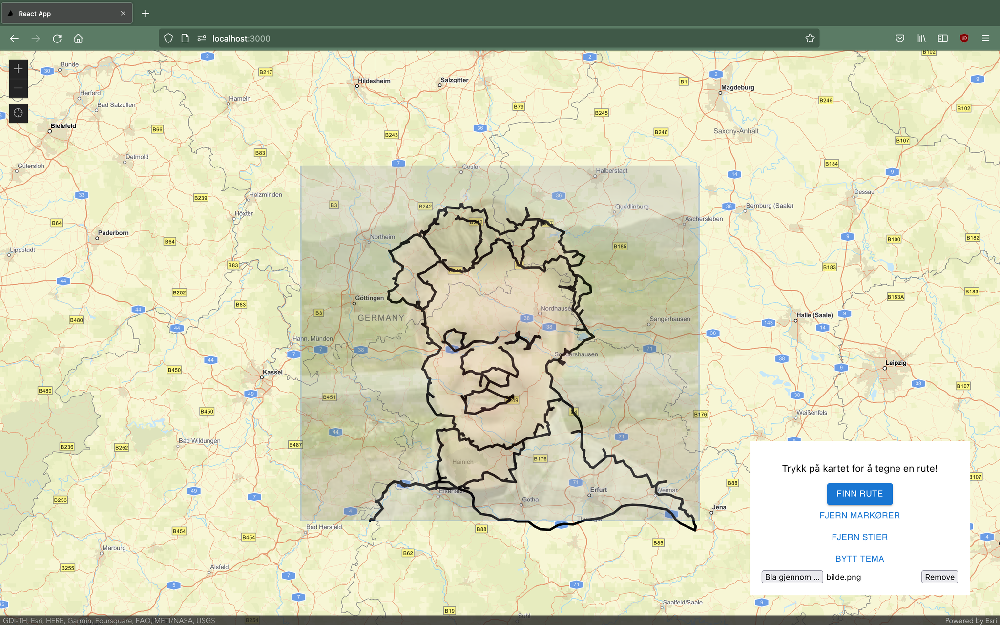
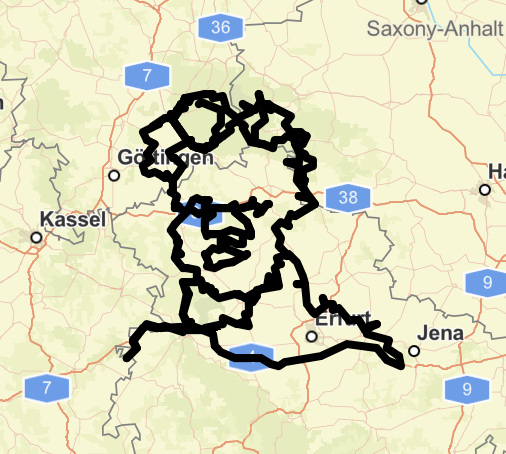
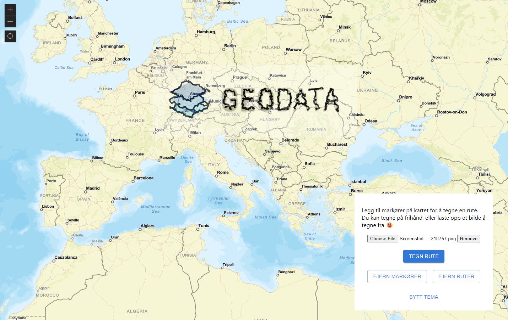

# GEOkunst

Du har sikkert hørt om [trenden](https://www.aftenposten.no/amagasinet/i/0ne9LB/de-lager-kunst-med-en-treningsapp) som går ut på å gå, sykle eller kjøre turer som forestiller ulike figurer, sett fra et fugleperspektiv. Men hvordan finner man disse rutene?

> Med GEOkunst kan hvem som helst tegne sine egne ruter, som tilfredsstiller den figuren man måtte ønske.

Har du sett at det ligger en blomst over London?

## Velg punkter og lag en veitegning

Alt du må gjøre er å velge et knippe punkter og trykke på "Tegn rute".

Ved å trykke på "Fjern markører" kan du slette punktene du har valgt og velge ny, for deretter å tegne en ny rute.

> Det betyr at du kan lage kompliserte tegninger med flere usammenhengende deler!

Se for eksempel denne anden, i nærheten av Amsterdam:

## Dessuten kan man laste opp et bilde for å enklere se hvor man skal sette punkter!

  
  
  

## Kanskje du vil kjøre GEODATA på langs i Europa i sommer?

## Vi har også dark mode 😎

Trykk "Bytt tema" for å bytte mellom.

## Hurtig planlegging av ruter

Det går dessuten både raskere og enklere å planlegge ruter med mange stopp enn med for eksempel Google Maps.

## Bakgrunn for prosjektet

GEOkunst er et resultat av et par timer arbeid på en [workshop](https://abakus.no/events/3249) med [Geodata](https://www.geodata.no/). Geodata stod for API og et React-skjelett. [Hans-Marius](https://github.com/hansmariusoveras) og [Magne](https://github.com/magnetenstad) kom opp med idéen, og ferdigstilte applikasjonen. (Vi tar gjerne imot tilbud om intervju til sommerjobb 2023 😇).
