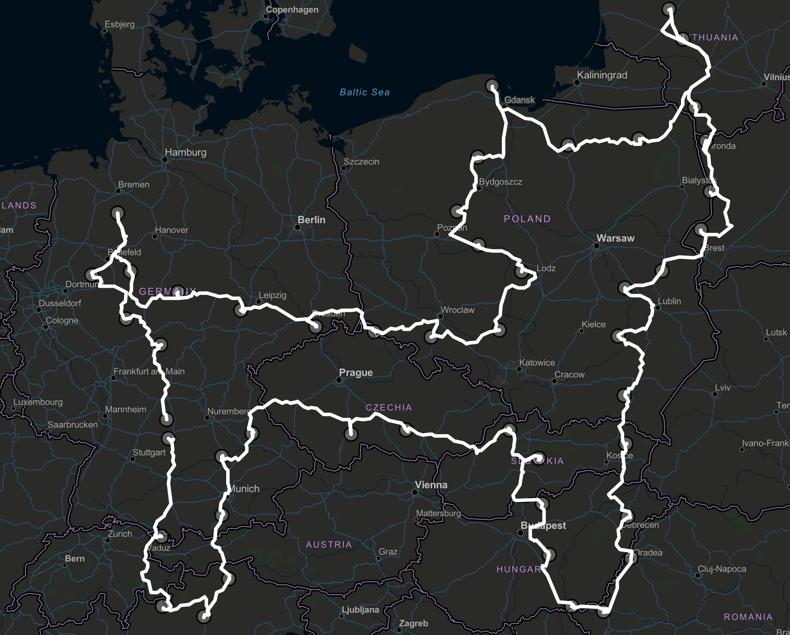

# GEOkunst

Du har sikkert hørt om [trenden](https://www.aftenposten.no/amagasinet/i/0ne9LB/de-lager-kunst-med-en-treningsapp) som går ut på å gå, sykle eller kjøre turer som forestiller ulike figurer, sett fra et fugleperspektiv. Men hvordan finner man disse rutene?

> Med GEOkunst kan hvem som helst tegne sine egne ruter, som tilfredsstiller den figuren man måtte ønske.

## Velg punkter og lag en veitegning

Alt du må gjøre er å velge et knippe punkter og trykke på "Finn rute".

Ved å trykke på "Fjern markører" kan du slette punktene du har valgt og velge ny, for deretter å tegne en ny rute.

## Det betyr at du kan lage kompliserte tegninger med flere usammenhengende deler!

Se for eksempel dette fantastiske eksempelet:

## Dessuten kan man laste opp et bilde for å enklere se hvor man skal sette punkter!

  
  
  

## Kanskje du vil kjøre GEODATA på langs i Europa i sommer?

